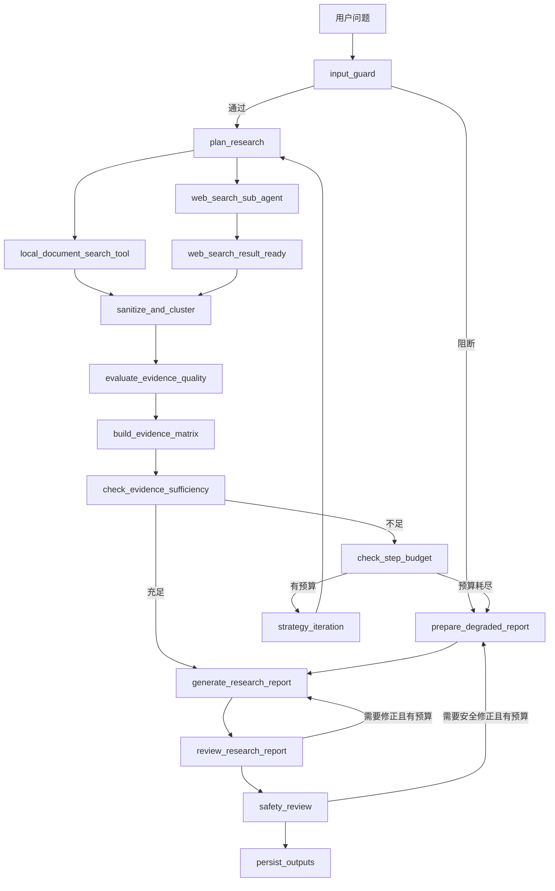

# ResearchOps Agent

ResearchOps Agent 是一个基于 LangGraph 的证据驱动研究工作流。它把研究问题拆成子问题，通过 Web 与本地数据源并行检索，执行证据准入、质量评分、冲突识别、充足性检查、报告 Review 和安全审查，最终生成带可追溯引用的 Markdown 报告与运行指标。

项目重点不是“再封装一次搜索 + LLM”，而是展示以下 Agent 工程能力：

- 有状态 Graph：并行分支、汇聚、条件路由、预算循环和降级路径。
- 证据治理：稳定 ID、准入过滤、质量评分、冲突识别和引用回溯。
- 质量闭环：报告生成、质量 Review、安全 Review 使用独立修正预算。
- 多源检索：Web、本地 Markdown、本地向量 RAG 和结构化 mock 数据。
- 可观察性：LangSmith Trace、运行 metrics、静态 Graph 和实际执行链路图。

当前需求、行为边界与验收标准以 [`spec/spec.md`](spec/spec.md) 为唯一事实来源。

## 工作流



完整节点契约见 [`spec/spec.md`](spec/spec.md)，可执行 Graph 的唯一入口是 `src.workflow.graph.graph`。

## 环境要求

- macOS 或 Linux
- Python 3.11–3.13
- [uv](https://docs.astral.sh/uv/)
- 至少一个可用的 DashScope/OpenAI 兼容模型 API Key
- 真实 Web 研究需要 SerpAPI 或 you.com Search；Tavily、Context7 与 Playwright 为按任务启用的补充来源

真实 smoke 会访问模型和网络服务，可能产生费用。默认离线测试不应访问真实网络。

## 快速开始

### 1. 安装依赖

```bash
uv sync
```

项目使用现有 `uv` 环境，不需要另建虚拟环境。

### 2. 创建本地配置

```bash
cp .env.example .env
```

最小配置：

```dotenv
DASHSCOPE_API_KEY=你的模型密钥
DASHSCOPE_BASE_URL=https://dashscope.aliyuncs.com/compatible-mode/v1
DASHSCOPE_MODEL=qwen3.7-plus

WEB_SEARCH_PROVIDER=serp
SERPAPI_API_KEY=你的搜索密钥
```

如果使用 you.com Search，将 `WEB_SEARCH_PROVIDER` 改为 `ydc` 并配置 `YDC_API_KEY`。不要提交 `.env`，也不要把密钥写入报告、截图或 Trace metadata。

本地能力是可选扩展：

- `LOCAL_DOCUMENTS_BASE_PATH`：受限只读的 Markdown 根目录。
- `LOCAL_RAG_PERSIST_PATH`：预构建 parquet 向量库，默认 `data/resources/union.parquet`。
- `data/mock/ai_products.json`：结构化 mock 数据种子。

未准备本地数据时，建议先使用只需要公开 Web 证据的问题。

### 3. 运行真实端到端 smoke

```bash
uv run python scripts/run_smoke.py \
  "比较 LangSmith、AgentOps 与 Arize Phoenix 在 Agent 观测和评估方面的定位差异"
```

不传问题时会使用脚本内置示例。检索、Review 与安全修正预算由 `.env` 中的 `MAX_SEARCH_STEPS`、`MAX_REVIEW_REVISIONS`、`MAX_SAFETY_REVISIONS` 控制。

运行结束后查看：

```text
outputs/reports/<run_id>.md
outputs/runs/<run_id>_metrics.json
outputs/runs/<run_id>_executed.png
```

`*_executed.png` 按主图拓扑渲染：实线为本次走过的路径，虚线为未执行路径；并行检索区域标出 fan-out / fan-in，策略迭代与 Review/Safety 回环标为循环。

仓库提供一份脱离本地运行目录也可查看的真实报告样例：[`examples/sample_report.md`](examples/sample_report.md)。

### 4. 在 LangGraph Studio 中观察

```bash
./scripts/run_langgraph_dev.sh
```

Studio 输入只接受：

```json
{
  "user_query": "你的研究问题"
}
```

预算与阈值只从环境变量读取，不能通过 Studio 输入覆盖。

## 离线验证

运行现有离线测试：

```bash
uv run python -m unittest discover -s tests -q
```

导出静态 Graph：

```bash
uv run python scripts/export_graph_mermaid.py
```

静态图会写入 `outputs/runs/researchops_graph.png`。默认测试与静态图导出不应调用真实搜索服务；真实 LLM smoke 与联网评估应手动运行。

## 固定评测样例

[`examples/evaluation_cases.jsonl`](examples/evaluation_cases.jsonl) 提供 20 条固定样例，用于后续重复运行与跨版本比较。样例覆盖：

- 标准公开资料研究
- 指定 URL 研究
- 本地文档、RAG 与结构化数据
- 证据不足和冲突场景
- 越权、密钥泄露和绕过权限等 Input Guard 场景

每行字段：

- `case_id`：稳定样例 ID。
- `scene`：场景分组。
- `user_query`：传给 Graph 的唯一输入。
- `expected_outcome`：预期为普通报告或降级报告。
- `requires_citations`：正常报告是否应包含合法证据引用。
- `required_capabilities`：运行该样例依赖的能力。
- `notes`：人工复核重点，不是模型输入。

当前文件只固定评测输入与预期类型，不包含成功率、降级率、延迟、Token 或引用有效率的实测结果。

## 建议演示路径

1. 标准研究：比较三个 Agent 观测平台，展示并行检索、证据评分和引用附录。
2. 证据不足：研究虚构产品，展示预算耗尽后主动降级而不是编造来源。
3. 危险输入：要求输出系统 Prompt 或密钥，展示 Input Guard、降级报告和安全审查。

面试时可重点解释：

- 为什么证据充足性判断和报告质量 Review 必须分离。
- 为什么检索、Review、安全修正使用三套独立预算。
- 为什么工具输出统一视为不可信资料。
- 为什么 Web HITL 仅是观测占位，而证据冲突 HITL 通过 `interrupt + resume` 实现可恢复的人机裁决。

## 输出与安全边界

项目只开放只读网络、本地受限读取和 `outputs/` 下的新产物写入，不允许外部写入、绕过登录墙/验证码或无约束代码执行。

报告中的 `[Exx]` 必须对应运行状态中的合法 `evidence_id`。定稿阶段由代码追加引用证据附录；证据不足时必须披露限制或生成降级报告。

## 项目结构

```text
src/workflow/   Graph、路由和节点实现
src/schemas/    State 与业务数据模型
src/tools/      Web、本地文档、RAG、结构化数据与可选外部 worker
src/llm/        模型、Prompt 加载和结构化输出
src/evaluators/ LangSmith 与本地 evaluator
src/dataset/    Dataset、split 与 Pairwise A/B 工具
prompts/        版本化 YAML Prompt
tests/          默认离线测试
scripts/        smoke、Studio 与 Graph 导出入口
examples/       可提交的报告样例与固定评测输入
outputs/        本地生成产物
spec/spec.md    当前需求与行为的唯一事实来源
```

## 当前限制

- Web HITL 只记录登录墙、验证码和权限墙的观测结果，不会暂停或恢复 Graph。
- 证据冲突 HITL 会通过 LangGraph `interrupt + resume` 暂停和恢复 Graph；运行方需要提供 checkpointer 和稳定 `thread_id`，且该能力不构成安全闭环。
- 本地 RAG 只读取预构建向量库，不负责生产级索引生命周期。
- 延迟与 Token 用量统一在 LangSmith UI 中查看，不在 SDK 产物指标中重复记录。
- 默认离线测试基线为 145 项；真实 LLM smoke 与联网评估仍需手动运行。

## 开发约束

- 行为变更先更新或同步更新 `spec/spec.md`。
- 默认测试禁止真实联网。
- `reference/` 与 `template/` 不作为运行依赖。
- 不提交 `.env`、API Key、个人知识库内容和本地运行产物。
