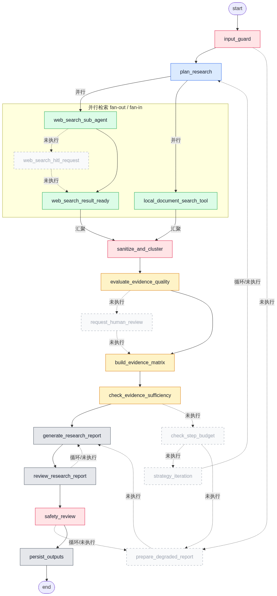
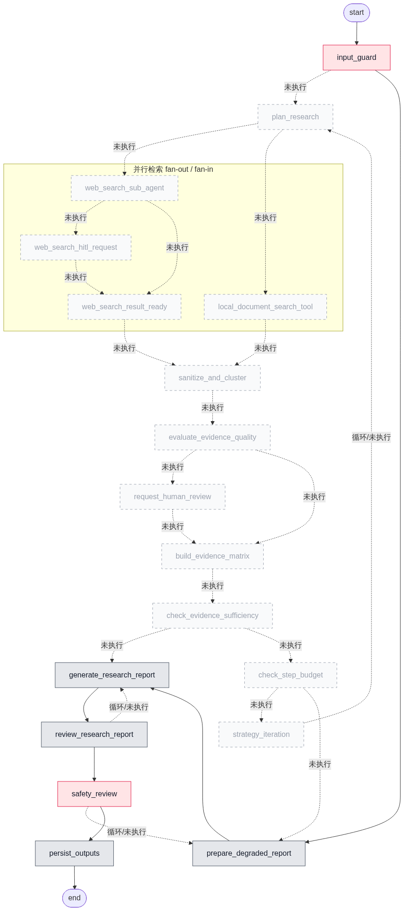

# ResearchOps 项目说明

基于 [LangGraph](https://github.com/langchain-ai/langgraph) 的证据驱动研究 Agent：把研究问题拆成子问题，并行检索 Web 与本地资料，完成证据准入、质量评分、冲突识别、充足性检查、报告 Review 与安全审查，最终产出带可追溯引用的 Markdown 报告。

项目侧重展示 Agent 工程能力，而不是简单的「搜索 + LLM」封装：

- **有状态 Graph**：并行分支、汇聚、条件路由、预算循环与降级路径
- **证据治理**：稳定证据 ID、准入过滤、质量评分、冲突识别与引用回溯
- **质量闭环**：报告生成、质量 Review、安全 Review 使用独立修正预算
- **多源检索**：Web、本地 Markdown、本地向量 RAG、结构化 mock 数据
- **可观察与可评估**：LangSmith Trace / Dataset / Experiment，配合证据利用率、降级、引用与工具分发等自定义指标

## 工作流

可执行 Graph 入口：`src.workflow.graph.graph`。

### Graph 设计图

静态编排图（`scripts/export_graph_mermaid.py` 导出），包含并行检索、策略迭代回环、报告 Review / 安全修正，以及两条 HITL 分支：


### 实际执行拓扑

每次真实运行会保存 `outputs/runs/<run_id>_executed.png`：实线为本次走过的路径，虚线为未执行分支；并行检索区域标注 fan-out / fan-in。

**标准研究路径**：Web 与本地并行检索后进入证据治理与报告闭环；策略迭代、冲突 HITL、Web HITL 在本趟未触发：



**危险输入降级路径**：`input_guard` 拦截后直达 `prepare_degraded_report`，跳过检索与证据链：



## 检索工具

Graph 固定并行触发 **本地检索** 与 **Web 检索**；各节点再按任务类型与工具特性调度。

### 本地检索

本地侧由路由 LLM 在同轮任务上选择一个或多个工具：

| 工具 | 方式 | 用途 |
| --- | --- | --- |
| `local_document` | 简单关键词检索 Markdown | 个人笔记、经验总结、非官方语料 |
| `local_rag` | 轻量向量 RAG（预构建 parquet） | 已入库文档的语义问答 |
| `structured_mock` | LLM 生成检索关键词 / 查询说明，再对本地结构化表做轻量搜索 | 产品名、价格、功能等字段对比 |

仓库不附带向量库与 mock 表，需自行接入；更换语料后同步改写 [`prompts/local_search_router.yml`](../prompts/local_search_router.yml)。

### Web 检索

| 工具 | 角色 | 处理方式 |
| --- | --- | --- |
| **SerpAPI / you.com（ydc）** | 主检索（`WEB_SEARCH_PROVIDER=serp` 或 `ydc`） | 通用搜索召回；经 LLM 重排序并保留 Top-K，再判断摘要是否够用、是否抓正文 |
| **Tavily MCP** | 辅助检索 | 返回按相关性排序的目标片段，直接作为证据 |
| **Context7 MCP** | 官方文档补充 | 面向官方文档 / 库文档类任务，结果可直接进入证据链路 |
| **Playwright MCP** | 正文抓取 | Serp/ydc 判定摘要不足时抓取选定 URL；query 含 URL 时也可直接抓取 |
| **Web HITL 占位** | 登录墙 / 验证码 / 权限墙观测 | 观测受限页面；不暂停 Graph，不因观测未完成而降级 |

## 设计要点

### 1. LLM 与确定性代码的职责边界

可复现的治理逻辑不依赖模型临场发挥；模型只在需要语义判断的位置出手。

| 由 LLM 负责 | 由代码负责 |
| --- | --- |
| 研究规划、本地工具路由、主检索重排与是否抓正文 | Web/本地工具调度、并发与限流、结果物化 |
| 报告生成与质量 Review | 证据清洗去重、分桶打分、冲突识别、充足性与预算判断 |
| 输入侧危险行为审查（Input Guard） | 输出侧规则安全审查、引用附录追加、降级状态整理、产物落盘 |

规划后固定 **fan-out** 并行 Web + 本地，再在 `sanitize_and_cluster` **fan-in** 汇聚，进入同一条证据治理链。

### 2. Prompt 契约 + 代码校验流水线

核心 Prompt 以 YAML 版本化管理（`prompts/`），声明 `output_schema`、枚举与必填规则，并给出最小完整 JSON 示例。LLM 节点要求 JSON 输出（`json_object` 或结构化输出绑定），写作/规划类默认低温。

返回后不直接信任，固定走：

1. 解析 JSON（兼容纯文本、content blocks、代码围栏）
2. 确定性 coerce（别名回填、缺省补齐、枚举归一；Web 汇总缺 URL/评分时可回填或填默认分）
3. Pydantic 校验（`src/llm/structured_outputs.py`）
4. 业务一致性校验（如 `question_id` / `search_tasks` 对齐、本地路由 `task_id` 全覆盖）

规划校验失败会把错误摘要回注 Prompt **重试 1 次**；仍失败则显式报错。

### 3. 按工具特性分流，而不是一套打分打天下

- **Serp/ydc**：召回覆盖广，但不是强相关排序 → LLM 重排 + 是否抓正文；抓正文时 LLM 主决策（`needs_page_fetch` / `fetch_url`），`relevance` 硬分可**否决**乱抓（被否决不改抓其他页），缺合法 URL 时才兜底最高分合格条。
- **Tavily / Context7**：结果本身已是高相关片段 → 直接物化为证据，不经主检索那套 LLM 重排。
- **Playwright**：按需补正文，不替代主检索。

### 4. `score_bucket` 分桶打分

不同工具的分数含义不可比，证据层按 `score_bucket`（如 `context7` / `tavily` / `serp` / `ydc` / `playwright`）分桶，用不同权威权重与公式计算 `reliability_score`，避免把 Context7、Tavily、Serp 的原始分直接混排比大小。

### 5. 信任边界与证据状态工程

- 工具回包统一视为不可信资料：准入后标记 `trust_boundary=untrusted_tool_output`，不当系统指令或既成事实。
- 稳定 `E{n}` / `C{n}` 目录化 ID；`entity_index` 只存跨对象关联（按题索引证据/冲突/任务、`used_evidence_ids`），不复制正文。
- 长文写入 `outputs/evidence/{evidence_id}.txt`（`content_path`），State 只留路径与短 snippet。
- 报告引用必须落在合法 `evidence_id` 白名单；非法引用剔除并写入 limitations；附录与 `used_in_final_report` / `used_evidence_ids` 由代码回写。
- 报告证据供给采用「全量短目录 + 按题精选长文」，并限制单条/总量字符。

### 6. 充足性与 Review 职责分离

- **充足性**（`check_evidence_sufficiency`）：按最低证据标准与 priority 加权判断「够不够、要不要补搜」，驱动策略迭代或降级。
- **质量 Review**：只评同证据可修正项（问题对齐、引用可追溯、边界披露、过度推断）；**禁止因证据少而 fail，禁止要求补搜**。

两套环各管各的控制权，避免质量环反向逼出无限检索。

### 7. 两条 HITL 不对称设计

| 类型 | 触发 | 行为 |
| --- | --- | --- |
| **Web HITL** | Playwright 登录墙 / 验证码 / 权限墙 | 观测占位；记录 `completed=false`；**不暂停 Graph，不因未完成降级** |
| **冲突 HITL** | 同题证据确定性冲突且 `hitl_need_score` 超阈值 | LangGraph `interrupt` 真实暂停；resume 校验 `conflict_id` 与四选一决策（prefer A/B、保留双方并披露、忽略）；写入冲突上下文，**不改写证据正文** |

冲突检测本身是确定性规则（极性/数值矛盾等）+ 可配置阈值，不是再让 LLM「感觉有没有冲突」。冲突 HITL 也不构成安全闭环。

### 8. 正规流程中的工具错误处理

工具出错**不会**直接跳进 `prepare_degraded_report`。失败先局部化；只有证据仍不足、预算耗尽或输入/安全闸拦截时，才走降级。

| 失败层级 | 典型场景 | 处理方式 |
| --- | --- | --- |
| **单工具软失败** | MCP 超时 / 缺 key / 连接错误 | 记 `ok=false`，**不抛出**；同任务继续合并其他来源 |
| **本地工具软失败** | Markdown / RAG / 结构化查询或路由失败 | `placeholder://...` 占位 + `blocked_reason`；准入阶段丢弃 |
| **主检索汇总软失败** | Serp/ydc 汇总 LLM 失败 | 代码 fallback + `summarize_error`，不重启工具循环 |
| **证据准入过滤** | 登录墙、占位 URL、无匹配等 | 丢弃后继续；最终不够再走充足性 / 预算 |
| **间接降级** | 多源失败导致证据不足 | 由充足性 → 预算决定：有预算则迭代补搜，耗尽才降级 |
| **节点硬失败** | 任务结构非法、未知 `source_type`、并发任务未捕获异常等 | **直接抛出**；契约破坏不允许用降级掩盖 |

原则：工具失败尽量软；降级是控制面决策；编排/契约错误要硬。

### 9. 三套独立预算 + 可降级出口

| 预算 | 控制对象 | 耗尽后行为 |
| --- | --- | --- |
| `MAX_SEARCH_STEPS` | 检索 / 策略迭代 | 证据仍不足则降级，而不是无限补搜 |
| `MAX_REVIEW_REVISIONS` | 报告质量修正 | 用现有证据收束，不再要求补搜 |
| `MAX_SAFETY_REVISIONS` | 安全修正 | 用确定性安全说明替换危险正文，禁止持久化危险原文 |

危险输入可在 `input_guard` 后直达降级；证据不足、预算耗尽、安全不通过也会走 `prepare_degraded_report`。配置缺失、Schema 不一致、路径越权等必须显式失败，不得用降级掩盖。

## 安装

环境要求：macOS / Linux，Python 3.11–3.13，[uv](https://docs.astral.sh/uv/)，以及可用的 DashScope / OpenAI 兼容模型密钥。真实 Web 研究需要 SerpAPI 或 you.com Search。

```bash
uv sync
cp .env.example .env
```

最小配置示例：

```dotenv
DASHSCOPE_API_KEY=你的模型密钥
DASHSCOPE_BASE_URL=https://dashscope.aliyuncs.com/compatible-mode/v1
DASHSCOPE_MODEL=qwen3.7-plus

WEB_SEARCH_PROVIDER=serp
SERPAPI_API_KEY=你的搜索密钥

# LangSmith 观测（可选，但推荐开启）
LANGSMITH_TRACING=true
LANGSMITH_API_KEY=你的 LangSmith 密钥
LANGSMITH_PROJECT=research-agent
```

使用 you.com Search 时，将 `WEB_SEARCH_PROVIDER` 改为 `ydc` 并配置 `YDC_API_KEY`。可选再配 `TAVILY_API_KEY`、`CONTEXT7_API_KEY` 以启用辅助检索与官方文档补充。不要提交 `.env`。

未接入本地资料时，建议先跑只需公开 Web 证据的问题。

## 使用

### 端到端运行

```bash
uv run python scripts/run_smoke.py \
  "比较 LangSmith、AgentOps 与 Arize Phoenix 在 Agent 观测和评估方面的定位差异"
```

检索、Review 与安全修正预算由 `.env` 中的 `MAX_SEARCH_STEPS`、`MAX_REVIEW_REVISIONS`、`MAX_SAFETY_REVISIONS` 控制。

运行结束后查看：

```text
outputs/reports/<run_id>.md
outputs/runs/<run_id>_metrics.json
outputs/runs/<run_id>_executed.png
```

报告样例：[`examples/`](../examples/)。

### LangGraph Studio

```bash
./scripts/run_langgraph_dev.sh
```

Studio 输入只接受：

```json
{
  "user_query": "你的研究问题"
}
```

预算与阈值只从环境变量读取，不能通过 Studio 输入覆盖。

### 接入本地资料（可选）

仓库不附带本地向量库与结构化 mock 数据，需自行准备后配置：

| 能力 | 配置 | 说明 |
| --- | --- | --- |
| 本地 Markdown | `LOCAL_DOCUMENTS_BASE_PATH` | 受限只读的 `.md` 根目录 |
| 本地向量 RAG | `LOCAL_RAG_PERSIST_PATH` | 预构建 parquet 向量库路径 |
| 结构化 mock | `data/mock/ai_products.json` → `ai_products.sqlite` | 由 `src/tools/structured_data.py` 读取；按自己的表结构准备 |

接入或更换语料后，请同步改写 [`prompts/local_search_router.yml`](../prompts/local_search_router.yml) 里对 `local_rag` / `structured_mock` / `local_document` 的能力描述与示例，使路由 Prompt 与真实语料领域一致；否则路由器可能按过时描述误选工具。

### LangSmith Dataset 脚本

`src/dataset/append_questions_to_dataset.py` 与 `src/dataset/split_examples.py` 中的 `DATASET_ID` / `dataset_id` 使用占位符 `your_langsmith_dataset_id`。运行前请改成你在 LangSmith 中创建的 Dataset UUID，并配置好 `LANGSMITH_API_KEY`。

## LangSmith 监测与优化

ResearchOps 把运行链路接到 LangSmith，用来做 Trace 复盘、Dataset 回归评测和指标驱动优化。正式评测样例覆盖五类场景：常规公开资料研究、指定 URL 研究、本地与 Web 结合、复杂多对象比较、危险输入直接降级。

评测关注的自定义指标包括：

| 指标 | 作用 |
| --- | --- |
| `evidence_utilization_rate` | 报告是否真正消费了检索到的证据 |
| `is_degraded` | 是否进入降级路径（危险输入、证据不足等） |
| `source_citation_count` | 最终报告对各来源的引用分布 |
| `source_dispatch_valid_count` | Web / 本地工具分发与有效结果情况 |
| Latency / Token Usage | 时延与成本，用于定位瓶颈与优化预算 |

样例维护入口：`src/dataset/append_questions_to_dataset.py`。Evaluator 实现位于 `src/evaluators/`。

### 正式样例实验截图

**常规公开资料研究**（`formal_general_research`）


**指定 URL 研究**（`formal_url_research`）


**本地资料 + Web 结合**（`formal_local_web_research`）


**复杂多对象比较**（`formal_complex_research`）


**危险输入直接降级**（`formal_dangerous_direct_degradation`）

危险请求在 Input Guard 阶段被拦截，`is_degraded=1.0`，不进入正常检索与引用路径：


### 如何用这些指标做优化

1. **证据质量**：`evidence_utilization_rate` 偏低时，优先检查证据准入、报告证据供给预算，以及 Review 是否要求了无法落地的补搜。
2. **工具成本**：从 `source_dispatch_valid_count` 看 Tavily / Playwright / Context7 / 主搜索的调用是否过密，再调 `WEB_SEARCH_*` 与任务并发。
3. **时延与 Token**：复杂研究与 URL 抓取通常最贵；可下调检索条数、正文截断长度、精选长文条数，或收紧 `MAX_SEARCH_STEPS`。
4. **安全与降级**：危险样例应稳定落到 `is_degraded=1`；若误伤常规研究，回看 Input Guard Prompt 与阈值。
5. **回归对比**：同一 Dataset 在 Prompt / 模型 / 预算变更后重跑 Experiment，对比利用率、降级率、延迟和 Token 变化。
